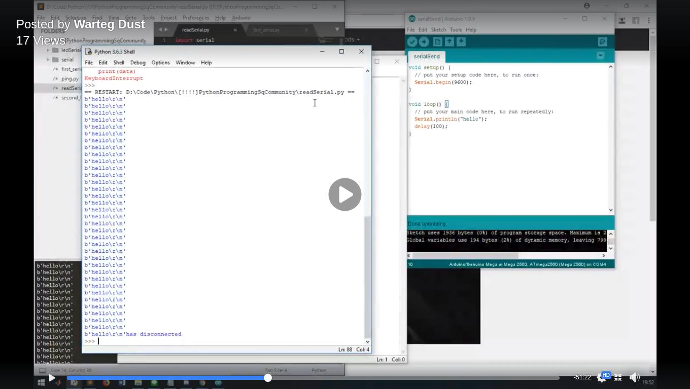

# Arduino Python

## About

Belajar serta memberi contoh tentang cara menggunakan dan menghubungkan Arduino dengan Python untuk mengotak-atik Arduino yang bertujuan untuk mempelajari lebih mengenai keduanya.

## Teacher

 - Warteg Dust (@wartegdust)

## Source Material

  - To Be Added
