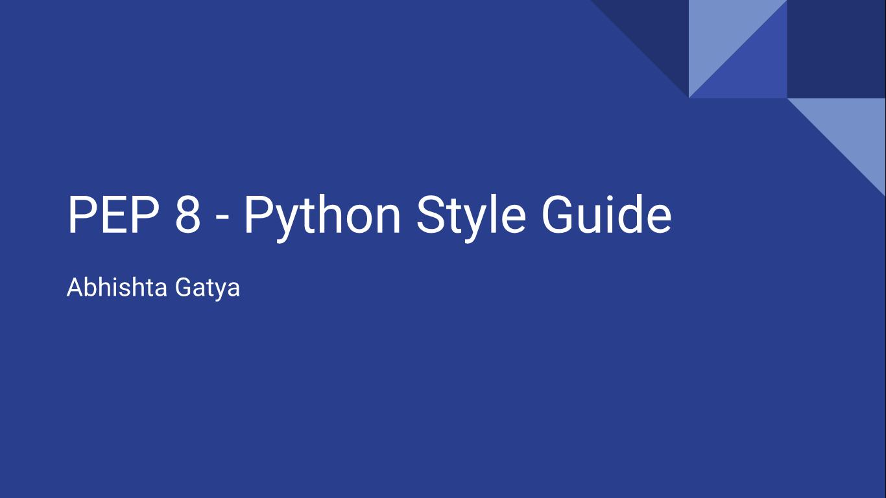

# PEP 8 Style Guide

## About

Tahukah kalian bahwa Python mempunyai style guide tertentu? Style Guide ini ternyata penting sekali ketika menulis source code Python kalian karena didalamnya merupakan rekomendasian untuk merapihkan serta membuat source code lebih mudah dibaca oleh developer python lainnya.

## Teacher

 - Abhishta Gatya (@gat)

## Source Material

  - [PEP 8](https://www.python.org/dev/peps/pep-0008/)
