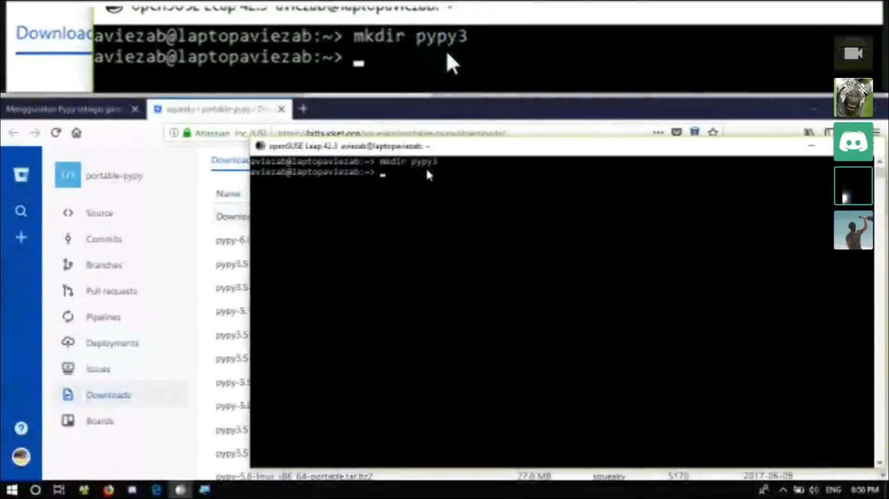

# Pypy Setup and Introduction

## About

PyPy adalah interpreter bahasa pemrograman python yang ditulis dengan Python dan dilengkapi dengan kompiler JIT (just in time). Pengembangan PyPy berfokus pada kecepatan unjuk kerja program, efisiensi, serta menjaga kompatibilitas dengan interpreter CPython.

## Teacher

 - Ashar (@aviezab)

## Source Material

  - To Be Added
